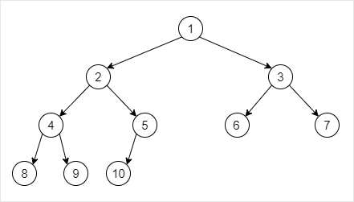

# 二叉树

## Node API

| API                | 功能                           |
| ------------------ | ------------------------------ |
| size()             | 报告以该节点为根的子树的规模   |
| insertAsLC(e)      | 作为当前节点的左孩子插入新节点 |
| insertAsRC(e)      | 作为当前节点的右孩子插入新节点 |
| succ()             | 取当前节点的直接后继           |
| travLevel(functor) | 层词遍历以该节点为根的子树     |
| travPre(functor)   | 前序遍历以该节点为根的子树     |
| travIn(functor)    | 中序遍历以该节点为根的子树     |
| travPost(functor)  | 后序遍历以该节点为根的子树     |

## Binary Tree API

| API                                 | 功能                                                      |
| ----------------------------------- | --------------------------------------------------------- |
| size()                              | 返回树的规模                                              |
| empty()                             | 判断树是否为空树                                          |
| root()                              | 返回树根                                                  |
| insertAsRoot(e)                     | 插入根节点根赋值为e                                       |
| insertAsLC(e)                       | 插入x的左孩子（原来并没有）并复制为e                      |
| insertAsRC(e)                       | 插入x的右孩子（原来并没有）并复制为e                      |
| attachAsLC(BinNode* x, BinTree*& T) | 树T作为x的左孩子接入                                      |
| attachAsRC(BinNode* x, BinTree*& T) | 树T作为x的右孩子接入                                      |
| remove(BinNode* x)                  | 删除以x处节点为根的子树，返回子树原先的规模               |
| secede(BinNode* x)                  | 将以x处节点为根的子树从原树中摘除并将该子树独立出来并返回 |
| travPre(functor)                    | 前序遍历树                                                |
| travIn(functor)                     | 中序遍历树                                                |
| travPost(functor)                   | 后序遍历树                                                |

## 测试

构建以下形状的树：  

### 前序遍历结果：

> 1       2       4       8       9       5       10      3       6       7

### 中序遍历结果：

> 8       4       9       2       10      5       1       6       3       7

### 后序遍历结果：

> 8       9       4       10      5       2       6       7       3       1

### 层词遍历结果：

> 1       2       3       4       5       6       7       8       9       10