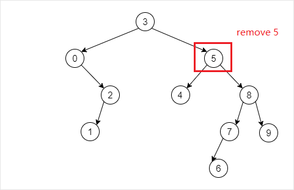
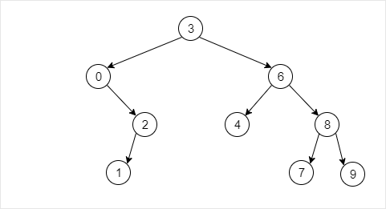

# BST Tree

## BST Tree API (public derived from BinTree)

|    API    |             功能             |
| :-------: | :--------------------------: |
| insert(e) | （按BST树规则）插入数据节点e |
| search(e) |    在BST树中查找数据节点e    |
| remove(e) | （按BST树规则）删除数据节点e |

---

### Initial BST Tree

In-Order traversal:

~~~sh
0       1       2       3       4       5       6       7       8       9
~~~

### Remove 5 from BST Tree

In-Order traversal:

~~~sh
0       1       2       3       4       6       7       8       9
~~~

